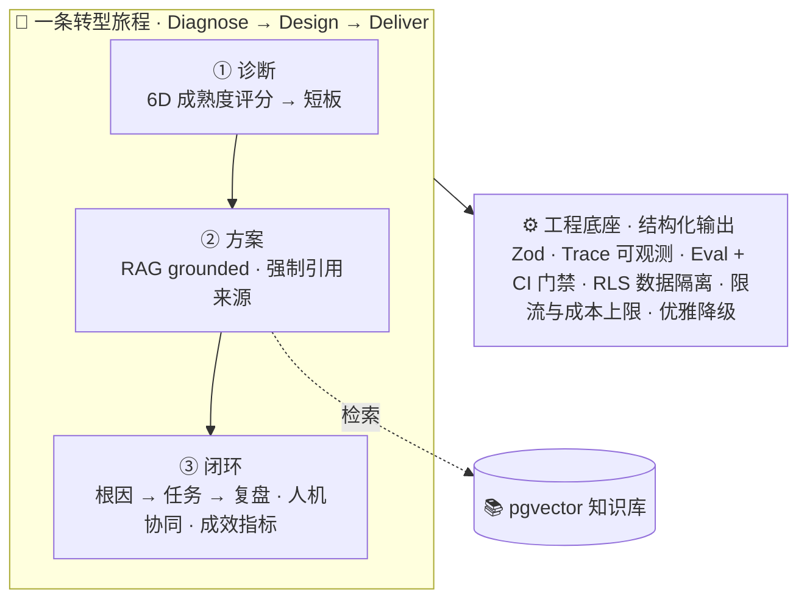

# 企业 AI 数智化转型工作台 · AI Transformation Workbench

**中文** ｜ [English](README.en.md)

> 端到端 AI 落地系统：把企业模糊的 AI 转型诉求，转化为**可信、可观测、可演示**的诊断、方案与业务闭环。

🔗 **在线体验**：<https://aiworkbench.wowonderwhy.com>

以「**Diagnose → Design → Deliver**」为方法主线，串起三个模块，并以**制造业质量异常闭环**作为完整样板。落地场景源自作者服务汽车电子/半导体等制造业客户的真实痛点。



---

## 一分钟看懂（直接体验真实 AI 产物）

公网入口"**查看真实 AI 示例**"展示的是真实 LLM+RAG 跑出的固化产物（零 key、零成本）：

| 模块 | 直达 |
|---|---|
| 诊断报告（结构化 AI 洞察） | [/diagnosis/report?id=28c7c17e…](https://aiworkbench.wowonderwhy.com/diagnosis/report?id=28c7c17e-7549-49e8-960c-16c3eeb0b84b) |
| 行业方案（grounded + 引用来源） | [/solution-builder/result?id=ddbec716…](https://aiworkbench.wowonderwhy.com/solution-builder/result?id=ddbec716-99d6-4e9a-84c1-069546310989) |
| 制造业闭环（根因→任务→复盘 + HITL） | [/manufacturing-demo/analysis?id=c7a1e47d…](https://aiworkbench.wowonderwhy.com/manufacturing-demo/analysis?id=c7a1e47d-9b8f-4c18-b8f4-6a684132da4c) |
| Trace Viewer（成本/延迟/调用追踪） | [/traces](https://aiworkbench.wowonderwhy.com/traces) |

## 核心能力

- **结构化诊断**：6D 成熟度问卷 → LLM 结构化洞察（Zod 校验）。
- **Grounded 方案**：RAG 检索知识库 → 方案/根因**强制引用来源**；无依据则诚实弃权。
- **业务闭环**：制造业质量异常 上报→根因→任务→看板(human-in-the-loop)→复盘，状态机 + 事件审计。
- **一条转型旅程**：诊断结论自动喂给方案，方案落到运营闭环，并给出**真实数据派生的闭环成效指标**（任务闭环率 / AI 自动化占比 / 可追溯审计数）。
- **可观测**：每次 LLM/embedding 调用写 `llm_traces`，`/traces` 看成本/延迟(p50·p95)/结构化输出/RAG 引用/错误。
- **可评测 + CI**：`npm run eval` 跑黄金集（schema/引用/**忠实度 LLM-as-judge**/召回）；**录制式回放**让评测无密钥进 CI（`tsc + 单测 + eval 回放 + build` 自动门禁）。
- **工程底座**：数据隔离（匿名登录 + Postgres RLS）、滥用/成本防护（公网真跑总开关 + 匿名每日 credits + 当日成本上限 + 限流）、provider 抽象（不写死厂商）、优雅降级、密钥仅服务端、公网真实快照。

## 关键结果

| 指标 | 数值 |
|---|---|
| 引用忠实度（eval 驱动） | **0/3 → 3/3** |
| 检索 recall@k | 2/2（案例库命中第一，cos 0.82） |
| 单次调用成本 / 延迟 | ≈ $0.005 / p50 ≈ 7s |
| 评测 scorecard | schema 100% · 引用有效 100% · 忠实度 3/3 · 召回 2/2 |

## 技术栈

Next.js 14（App Router）· React 18 · TypeScript · Tailwind · Supabase（Postgres + **pgvector**）· OpenAI 兼容 LLM（默认 DeepSeek，可切 Qwen/OpenAI）· 百炼 `text-embedding-v4` · Zod · Vercel。

## 文档

| 文档 | 内容 |
|---|---|
| [docs/ARCHITECTURE.md](docs/ARCHITECTURE.md) | 架构总览 + 数据流图（Mermaid） |
| [docs/ADR.md](docs/ADR.md) | 架构决策记录（为什么这么做 + 取舍 + 已知边界） |

## 本地运行

```bash
npm install
cp .env.example .env.local     # 填 Supabase 与 LLM/Embedding key（见 .env.example 注释）
# 在 Supabase SQL Editor 依次运行 supabase/migrations/*.sql（0001 → 0002 → 0003）
# 并在 Supabase 后台开启「Anonymous sign-ins」（用于 RLS 数据隔离）
npm run ingest                 # 知识库灌库（chunk → embedding → pgvector）
npm run dev                    # http://localhost:3000
npm run eval                   # 在线评测（需 dev server 在跑 + key）
npm test                       # 纯函数单测（无密钥）
npm run eval:ci                # 录制式 eval 回放（无密钥、离线）
```

> 默认 `PUBLIC_AI_ENABLED=false` 时自动降级为规则路径，公网可保持真实 AI 快照（不触发付费调用）。需要公网真跑时，显式设置 `PUBLIC_AI_ENABLED=true`；默认每个匿名主体每日 15 credits，全站每日 LLM + Embedding 成本上限为 $1。

## 状态与边界（诚实声明）

**演示 / 预览版**。已知取舍与路线图见 [ADR-0008](docs/ADR.md#adr-0008--已知缺口与路线图诚实边界)：公网默认仍可作为真实快照模式，打开 `PUBLIC_AI_ENABLED=true` 后支持有限额真跑，trace 为平表。工程底座已具备：数据隔离（匿名登录 + Postgres RLS 修复 IDOR，[ADR-0010](docs/ADR.md#adr-0010--匿名登录--rls-数据隔离修复-idor)）、滥用与成本防护（公网真跑总开关 + 匿名每日 credits + 当日 LLM/Embedding 成本上限 + 限流，超限优雅降级，[ADR-0013](docs/ADR.md#adr-0013--滥用与成本防护限流--当日成本上限)）、CI 自动门禁（tsc + 纯函数单测 + **录制式 eval 回放**，全程无密钥，[ADR-0012](docs/ADR.md#adr-0012--接入-ci自动门禁) / [ADR-0014](docs/ADR.md#adr-0014--录制式-eval-进-ci离线无密钥的评测门禁)）。仍待补：真正账号体系（匿名身份绑定浏览器）、组织级多租户、API 集成测试、trace 升级 span 树。

## 作者

By **Connie Wang** — AI FDE / AI解决方案 / 客户成功。本项目由本人用 [Claude Code](https://claude.com/claude-code) 从 0 到 1 设计与实现。
