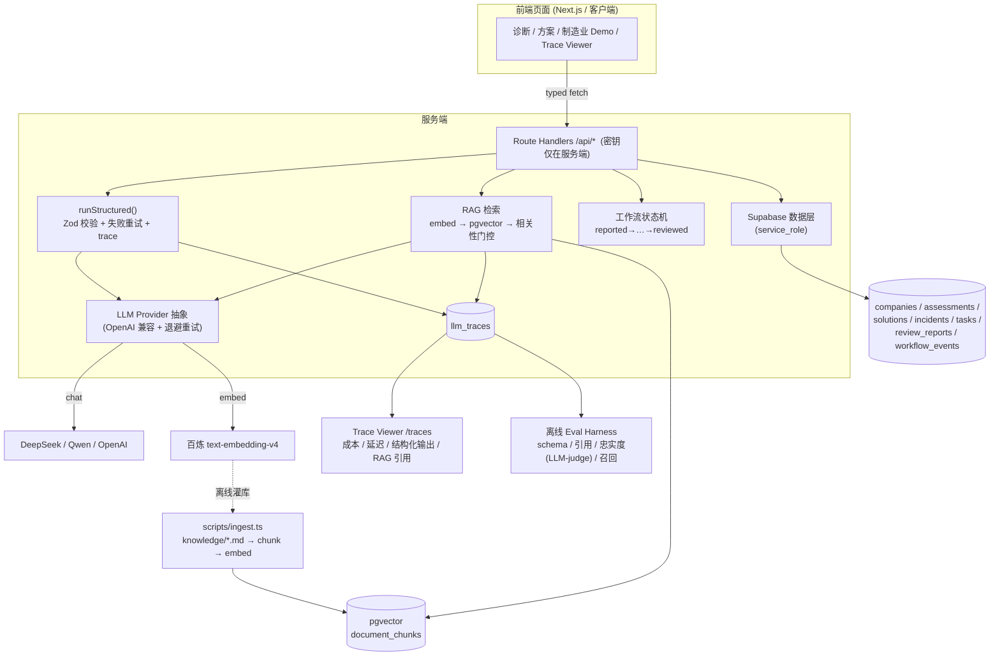

# 架构总览 · Architecture

> 企业 AI 数智化转型工作台 —— 端到端 AI 落地系统的架构与数据流。

## 1. 设计目标

把"模糊的 AI 转型诉求"转化为**可信、可观测、可演示**的端到端系统，体现 工程上关注四件事：

1. **结构化**：模糊诉求 → 结构化诊断 / 方案 / 根因（强制 schema 校验）。
2. **Grounded**：方案与根因基于知识库 RAG，**带可核验的引用**，无依据时诚实弃权。
3. **嵌入业务**：把 AI 塞进制造业质量异常的真实闭环（状态机 + human-in-the-loop）。
4. **Production-minded**：可观测（trace）、可评测（eval）、可测试（单测 + CI）、优雅降级、密钥隔离、可维护。

## 2. 技术栈

| 层 | 选型 |
|---|---|
| 前端 | Next.js 14（App Router）· React 18 · TypeScript · Tailwind |
| 后端 | Next.js Route Handlers（`/api/*`，Node runtime） |
| 数据库 | Supabase（Postgres）+ **pgvector**（embedding 检索） |
| LLM | OpenAI 兼容 provider 抽象（默认 DeepSeek `deepseek-chat`，可切 Qwen/OpenAI） |
| Embedding | 阿里百炼 `text-embedding-v4`（1536 维） |
| 校验 | Zod（结构化输出 schema 即真值来源） |
| 部署 | Vercel · 域名 aiworkbench.wowonderwhy.com |

## 3. 系统数据流



## 4. 三大模块 = 同一条 AI 管线的三个实例

| 模块 | 输入 | 管线 | 产出 |
|---|---|---|---|
| **Diagnose** 企业诊断 | 6D 问卷 + 企业信息 | 规则评分 → LLM 结构化洞察 → trace | 成熟度等级 + 核心瓶颈 + AI 洞察 |
| **Design** 行业方案 | 行业/客户/痛点 | RAG 检索 → LLM grounded 生成（强制引用） → trace | 方案概述 + 推荐（带来源）+ 角色价值 |
| **Deliver** 制造业闭环 | 质量异常上报 | RAG grounded 根因 → 任务 → 看板(HITL) → 复盘；状态机全程 trace | 根因(带引用) + 闭环任务 + 复盘报告 |

> 共性 `输入 → 检索 → 结构化生成 → 校验 → 后处理 → 降级 → trace` 已收敛到统一的 **`runAITask`** 运行器（`lib/ai/task.ts`），四个模块只是它的声明式任务配置（`lib/ai/tasks/*`）。见 [ADR-0009](ADR.md#adr-0009--统一-aitask-抽象合并规则llm-双路径)。

## 5. 关键工程机制

- **结构化输出**：`lib/llm/run.ts` 用 JSON 模式 + Zod 校验 + 有界 repair 重试；每次调用写 `llm_traces`。
- **RAG grounding**：`lib/rag/retrieve.ts` 检索后做**相关性门控**（cos ≥ 0.48）；生成提示要求"有依据才引用、无依据则弃权"；`evals/` 用 **LLM-as-judge 忠实度**核验"引用≠依据"。
- **工作流状态机**：`lib/workflow/incident.ts` 校验合法转移，每次流转写 `workflow_events`（区分 `ai` / `human`）。
- **可观测性**：`/traces` 读 `llm_traces`，展示成本/延迟(p50/p95)/结构化输出/RAG 引用/错误。
- **可评测**：在线 `npm run eval` 跑黄金集出 scorecard；**录制式 eval**（`npm run eval:record` 录、`eval:ci` 回放）把响应与裁判结果固化为磁带，使评测能**无密钥、确定性地进 CI**（[ADR-0014](ADR.md#adr-0014--录制式-eval-进-ci离线无密钥的评测门禁)）。
- **可测试 / CI**：纯逻辑单测 `npm test`（无密钥），GitHub Actions 每次 push/PR 自动跑 **tsc + test + eval 回放 + build**（[ADR-0012](ADR.md#adr-0012--接入-ci自动门禁)）。
- **优雅降级**：未配 LLM/DB key 时回落规则路径；公网用**固化的真实 AI 快照**（`data/featured/*`）展示真实产物，零成本零滥用。
- **密钥安全**：客户端不直连 DB/LLM；service_role 与 LLM key 仅服务端。
- **滥用 / 成本防护**：按主体（匿名 JWT 的 sub，回退 IP）限流（`lib/ratelimit.ts`，超限 429）；**当日 LLM 成本上限**（`lib/llm/budget.ts`）直接复用 `llm_traces.cost_usd` 做预算闸，超限即按"LLM 不可用"降级为规则路径（[ADR-0013](ADR.md#adr-0013--滥用与成本防护限流--当日成本上限)）。

## 6. 目录结构

```
app/            页面 + Route Handlers (/api/*)
components/     UI 组件（按模块拆分）
data/           结构化数据、类型、featured 真实快照
lib/
  llm/          provider 抽象 / runStructured / 成本
  rag/          embed / chunk / retrieve
  workflow/     异常状态机
  schemas/      Zod 结构化输出 schema
  eval/         评测器 + LLM-as-judge
  incident,solution,diagnosis/  各模块业务逻辑
scripts/        ingest.ts(灌库) / eval.ts(评测)
knowledge/      RAG 语料（合成、标注来源）
supabase/migrations/  schema + pgvector + RPC
evals/          黄金集 + latest.json + cassettes.json(录制式回放磁带)
tests/          纯函数单测（Node 内置测试 + tsx，无密钥）
.github/workflows/  ci.yml（tsc + test + build 自动门禁）
docs/           本套文档（架构 / ADR）
```
